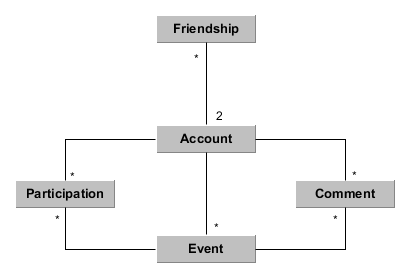
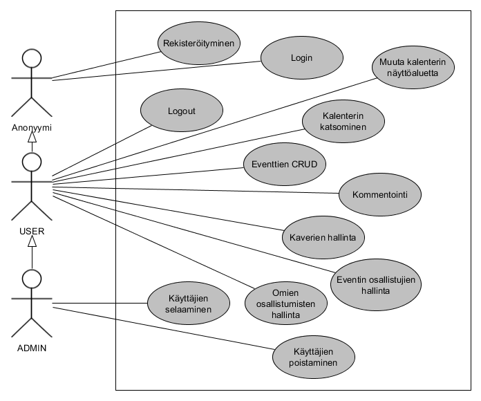

# Wepakalenteri

Eero Kuurne (014467642)

Sami Bäckroos (014450565)

Marianne Närhi (014339356)

## Yleistä

Tarkoituksena on luoda web-pohjainen kalenterisovellus, jossa käyttäjä voi itse valita näkyvillä olevan ajanjakson pituuden vapaasti. Kalenteriin voi lisätä tapahtumia, joilla on alku- ja loppuajankohdat sekä muuta tarpeellista infoa. Nämä ajankohdat näytetään kalenterissa, jos ne osuvat näytetylle aikavälille. 

Käyttäjät voivat myös lisätä toisiaan kavereiksi. Tämän tehtyään käyttäjät voivat lisätä kavereitaan omiin tapahtumiinsa osallistujiksi ja mikäli lisätty käyttäjä hyväksyy osallistumisen näytetään tapahtuma myös hänen kalenterissaan. Tapahtuman omistaja sekä osallistujat pystyvät myös lisäämään tapahtumaan kommentteja.

### Linkkejä

Sovellus löytyy osoitteesta: https://wepakalenteri.herokuapp.com.

Lähdekoodi löytyy Githubista: https://github.com/eekuurne/wepakalenteri.

## Järjestelmän tietosisältö

###Käsitekaavio

## Yleiskuva järjestelmästä

###Käyttötapauskaavio

### Käyttäjäryhmät

**Anonyymi käyttäjä**

Käyttäjätunnukseton käyttäjä, joka on olemassa vain login- ja rekisteröitymissivuilla.

**USER**

Tavallinen kirjautunut käyttäjä, joka voi käyttää kaikkia sivuston toimintoja lukuunottamatta admintoimintoja. Rekisteröidyt tunnukset ovat kaikki tällaisia.

**ADMIN**

Adminilla on kaikki *USER*in oikeudet, mutta pystyy lisäksi käyttämään admintoimintoja sivulla "/admin".

### Käyttötapauskuvaukset

**Anonyymi käyttäjä**

- Muut käyttötapaukset: login, rekisteröityminen

**USER**

- Kalenterin näyttöalueen muuttaminen:
  * Esivaatimus: login
  * Käyttäjä navigoi kalenterisivulle (login uudellenohjaa tänne)
  * Käyttäjä valitsee haluamansa aikavälin sivun ylälaidan valitsimilla (joillakin selaimilla 2 input laatikkoa) ja painaa "Show" -nappia
  * Jos käyttäjä valitsi validit päivät (alku ennen loppua) näytetään käyttäjälle valitsimen alla olevassa kalenterissa haluttu aikaväli ja siihen liittyvät tapahtumat kokonaisina viikkoina. Jos käyttäjä ei syöttänyt valideja arvoja ohjelma käyttää valmiita defaulttiarvoja.
- Kaverien hallinta:
  * Käyttäjä navigoi profiilisivulle
  * Käyttäjä käyttää profiilisivulla "Friends" osion nappeja ja kaverinlisäysformia kavereiden lisäykseen ja poistoon
  * Kaverin lisäämisen jälkeen toisen käyttäjän on hyväksyttävä kaveripyyntö
- Muut käyttötapaukset: Kalenterin katsominen

### Toteutetut käyttötapaukset

- Login/logout
- Kalenterin katsominen
- Kalenterin näyttöalueen muuttaminen
- Kaverien hallinta
- Osallistumisten hallinta
- Eventtien katselu
- Eventtien lisääminen
- Eventtien poistaminen ja editointi
- Admintoiminnot (käyttäjien poistaminen)

### Toteuttamattomat käyttötapaukset

- Muut admintoiminnot

